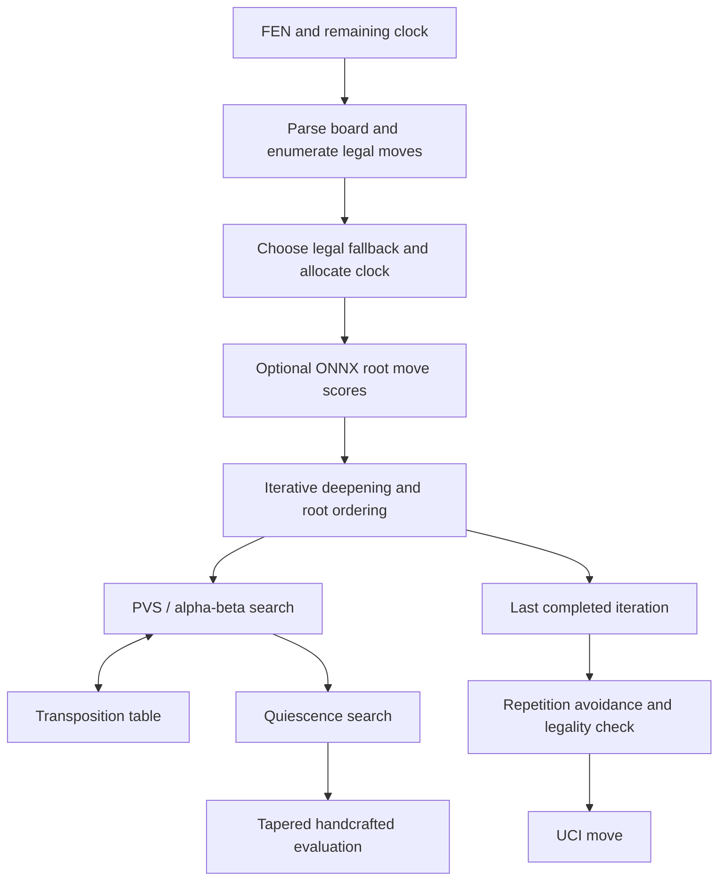

# Architecture

MilkyWay has two preserved implementations. The maintained root is the Python
engine with optional ONNX root ordering. The last documented competition package,
`agent_tm_20260911.zip`, is a separate original Numba search engine with a compact
learned value residual. These are not interchangeable builds. See
[build provenance](BUILD_PROVENANCE.md).

## Root engine move pipeline

| Module | Responsibility |
| --- | --- |
| `agent.py` | Public `get_move(fen, time_left_ms)` entry point; parsing and final legality check |
| `engine.py` | Persistent game state, fallback, search orchestration and repetition avoidance |
| `search.py` | Iterative deepening, aspiration windows, PVS, pruning and quiescence |
| `evaluation.py`, `constants.py`, `fast_eval.py` | Handcrafted scoring, parameters and numerical evaluation helpers |
| `move_ordering.py` | TT move, promotions, captures, killers, history and root policy scores |
| `transposition.py`, `engine_types.py` | Bounded search cache, bound types and search statistics |
| `time_manager.py` | Soft/hard deadlines, reserves and emergency budgets |
| `root_policy.py` | Board encoding and optional single-threaded ONNX inference |

Iterative deepening completes depth one before trying depth two and beyond. This
provides a usable answer when the deadline interrupts a deeper iteration.
Alpha-beta avoids branches that cannot improve the current decision. Principal
Variation Search (PVS) initially tests most alternatives with a narrow score
window, then searches again when they look promising.

The transposition table caches positions reached by different move orders. Entries
store depth, score bounds and a preferred move; generations and bounded FIFO
replacement control memory. Quiescence extends tactical exchanges beyond the
nominal depth so an unfinished capture sequence is not mistaken for a stable gain.

Late move reductions (LMR) search less promising late moves more shallowly, with
re-search when needed. Null-move pruning tests whether a position remains good
even after yielding a turn, with guards for unsuitable positions. Futility and
reverse-futility pruning use static score margins to avoid unlikely improvements.
These are heuristic tradeoffs, not proofs of perfect play.

Evaluation blends middlegame and endgame scores according to remaining material.
It considers material, piece placement, pawn structure, mobility, rook activity,
king safety and simple winning-endgame positioning.

## State, repetition and failure behavior

A module-level engine instance survives between moves in one game. Its search
table, ordering heuristics and observed-position counts persist. The root engine
records incoming positions and positions after its own moves; the search combines
game history with its current line. It cannot recover unseen history before the
first FEN. The referee remains the authority for draws.

The compiled packaged implementation instead tries to identify the intervening
legal opponent move and extend its board history; it resets the tracked sequence
when synchronization fails.

For a playable input, the root chooses a deterministic legal fallback, preferring
mate in one or valuable captures. Search and policy exceptions have fallback paths,
and the returned move is checked against the original legal moves. Malformed FENs
or positions with no legal moves return `0000`; that is a defensive sentinel, not
a legal move in a playable position. This does not guarantee recovery from every
possible process or resource failure.

## Clock and neural inference

The root allocates soft and hard deadlines from the remaining clock, retains a
reserve and polls more frequently in emergencies. A soft deadline stops additional
iterations; the hard deadline interrupts search. Very small clocks and forced
replies use the fallback path. Policy inference consumes part of the move budget.

`root_policy.py` loads `weights/milkyway_policy.onnx` during import when available.
It defaults to enabled; `MILKYWAY_ROOT_POLICY=0` disables it. Inference uses the CPU
provider with one intra-op and one inter-op thread. Missing or unusable models
leave classical ordering available. An 18-plane board tensor produces scores for
legal root moves. Those scores influence ordering, not leaf evaluation or legality.

Root-only inference amortizes neural overhead over a whole search. Paying the same
cost at every leaf would consume the single-core budget rapidly. Historical policy
ablation did not establish a strength gain; enabling the model is an implementation
fact, not evidence that it caused the event result.

The packaged TM implementation has no ONNX root policy. Its own compiled search
loads `weights/compact_value.npz` and blends a small team-trained positional
residual at coefficient 0.25. Its recursive functions warm during import.

Competition constraints are recorded historically in the
[postmortem](POSTMORTEM.md); the [official contract](https://aichessathon.com/docs/agent-contract.md)
remains the external source. The harness is preserved unchanged.
